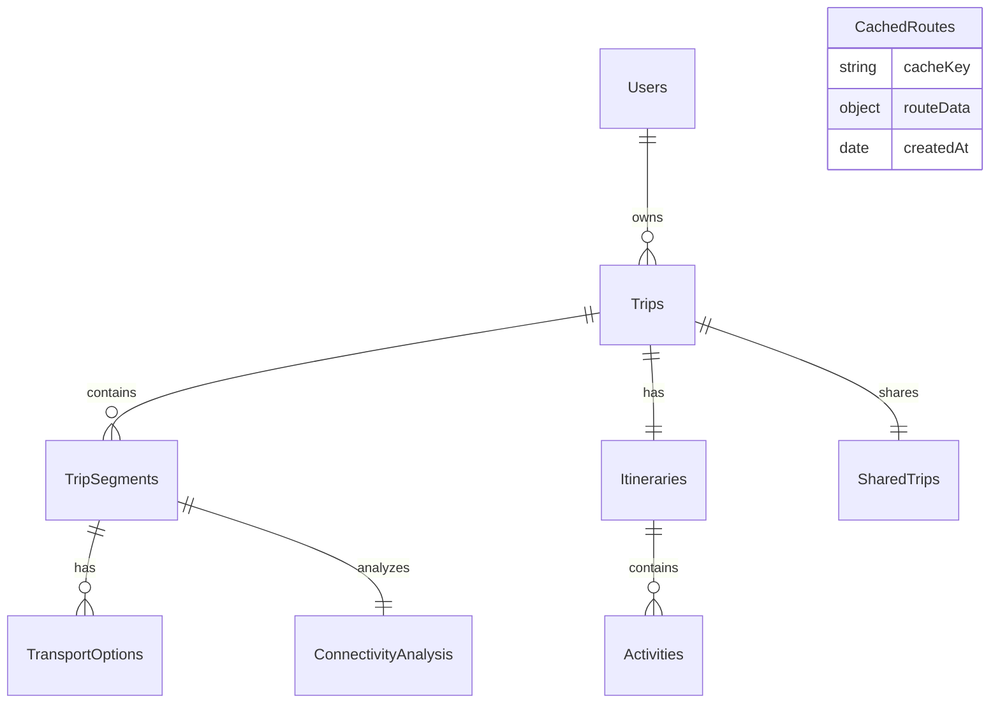

# Database Design Document - AI Trip Planner

This document defines the database schemas, collection structures, relationships, indexing strategies, and query pipelines for the AI Trip Planner application, built on **MongoDB** and **Mongoose**.

---

## 1. Entity Relationship (ER) Diagram

The diagram below maps the relationships across our database collections.



---

## 2. Collection Specifications

### 2.1. Users Collection

*   **Purpose:** Stores user profiles, authentication credentials (password hashes), and system settings.
*   **Schema (Mongoose):**
    ```javascript
    const UserSchema = new mongoose.Schema({
      email: { type: String, required: true, unique: true, lowercase: true, trim: true },
      passwordHash: { type: String, required: true },
      name: { type: String, required: true, trim: true },
      isDeleted: { type: Boolean, default: false },
      deletedAt: { type: Date, default: null }
    }, { timestamps: true });
    ```
*   **Relationships:** One-to-many relationship with the `Trips` collection.
*   **Indexes:**
    *   `{ email: 1 }` (Unique, ascending) - Fast lookup during login.
*   **Validation Rules:**
    *   `email`: Match standard email regex `/^\S+@\S+\.\S+$/`. Min length 5, max 255.
    *   `passwordHash`: Match bcrypt hash length (60 characters).
    *   `name`: Alphanumeric characters and spaces only. Min length 2, max 100.
*   **Sample Document:**
    ```json
    {
      "_id": "60c72b2f9b1d8b2c4d9a1e01",
      "email": "john.doe@example.com",
      "passwordHash": "$2b$10$K3bW9w2zD2hIeR1xO4m5ue3f/D29aK4v1k8n5m8y7c...",
      "name": "John Doe",
      "isDeleted": false,
      "deletedAt": null,
      "createdAt": "2026-06-10T21:17:35.000Z",
      "updatedAt": "2026-06-10T21:17:35.000Z",
      "__v": 0
    }
    ```

---

### 2.2. Trips Collection

*   **Purpose:** Stores overall metadata for planned trips, including budget boundaries, travel dates, and current active states.
*   **Schema (Mongoose):**
    ```javascript
    const TripSchema = new mongoose.Schema({
      userId: { type: mongoose.Schema.Types.ObjectId, ref: 'User', required: true },
      origin: { type: String, required: true, trim: true },
      destinationList: [{ type: String, required: true, trim: true }],
      startDate: { type: Date, required: true },
      endDate: { type: Date, required: true },
      budgetTier: { type: String, enum: ['Budget', 'Moderate', 'Luxury'], required: true },
      totalCost: { type: Number, default: 0 },
      isDeleted: { type: Boolean, default: false },
      deletedAt: { type: Date, default: null }
    }, { timestamps: true });
    ```
*   **Relationships:**
    *   Belongs to `Users` (referenced by `userId`).
    *   Has many `TripSegments`.
    *   Has one `Itineraries` collection document.
*   **Indexes:**
    *   `{ userId: 1 }` - Fetch all trips of a user.
    *   `{ startDate: 1, endDate: 1 }` - Temporal queries.
*   **Validation Rules:**
    *   `startDate`: Must be a valid date.
    *   `endDate`: Must be after `startDate`.
    *   `destinationList`: Cannot be empty.
*   **Sample Document:**
    ```json
    {
      "_id": "60c72b2f9b1d8b2c4d9a1e02",
      "userId": "60c72b2f9b1d8b2c4d9a1e01",
      "origin": "Anakapalle",
      "destinationList": ["Shirdi", "Tirupati", "Hyderabad"],
      "startDate": "2026-08-01T00:00:00.000Z",
      "endDate": "2026-08-10T00:00:00.000Z",
      "budgetTier": "Moderate",
      "totalCost": 350.00,
      "isDeleted": false,
      "deletedAt": null,
      "createdAt": "2026-06-10T21:17:35.000Z",
      "updatedAt": "2026-06-10T21:17:35.000Z"
    }
    ```

---

### 2.3. TripSegments Collection

*   **Purpose:** Represents travel legs between destinations on multi-city trips.
*   **Schema (Mongoose):**
    ```javascript
    const TripSegmentSchema = new mongoose.Schema({
      tripId: { type: mongoose.Schema.Types.ObjectId, ref: 'Trip', required: true },
      sequenceOrder: { type: Number, required: true },
      source: { type: String, required: true, trim: true },
      destination: { type: String, required: true, trim: true },
      estimatedCost: { type: Number, default: 0 },
      estimatedDuration: { type: Number, default: 0 }
    }, { timestamps: true });
    ```
*   **Relationships:**
    *   Belongs to `Trips` (referenced by `tripId`).
    *   Has many `TransportOptions`.
    *   Has one `ConnectivityAnalysis`.
*   **Indexes:**
    *   `{ tripId: 1, sequenceOrder: 1 }` (Compound index) - Retrieves and orders segment details fast.
*   **Validation Rules:**
    *   `sequenceOrder`: Positive integer starting at 0.
    *   `estimatedCost`: Minimum value: 0.
    *   `estimatedDuration`: Minimum value: 0.
*   **Sample Document:**
    ```json
    {
      "_id": "60c72b2f9b1d8b2c4d9a1e03",
      "tripId": "60c72b2f9b1d8b2c4d9a1e02",
      "sequenceOrder": 0,
      "source": "Anakapalle",
      "destination": "Shirdi",
      "estimatedCost": 135.00,
      "estimatedDuration": 360,
      "createdAt": "2026-06-10T21:17:35.000Z"
    }
    ```

---

### 2.4. Itineraries Collection

*   **Purpose:** Houses the daily organizational schedules mapped out by the itinerary generator agent.
*   **Schema (Mongoose):**
    ```javascript
    const ItinerarySchema = new mongoose.Schema({
      tripId: { type: mongoose.Schema.Types.ObjectId, ref: 'Trip', required: true, unique: true },
      daysCount: { type: Number, required: true },
      themeSummary: { type: String, default: "" }
    }, { timestamps: true });
    ```
*   **Relationships:**
    *   Belongs to `Trips` (referenced by `tripId`).
    *   Has many `Activities`.
*   **Indexes:**
    *   `{ tripId: 1 }` (Unique) - Resolves trip schedule mappings.
*   **Validation Rules:**
    *   `daysCount`: Minimum value: 1.
*   **Sample Document:**
    ```json
    {
      "_id": "60c72b2f9b1d8b2c4d9a1e04",
      "tripId": "60c72b2f9b1d8b2c4d9a1e02",
      "daysCount": 9,
      "themeSummary": "Divine pilgrimage and city exploration of Shirdi, Tirupati, and Hyderabad",
      "createdAt": "2026-06-10T21:17:35.000Z"
    }
    ```

---

### 2.5. Activities Collection

*   **Purpose:** Stores individual activities scheduled during travel days. Includes geospatial location points for maps.
*   **Schema (Mongoose):**
    ```javascript
    const ActivitySchema = new mongoose.Schema({
      itineraryId: { type: mongoose.Schema.Types.ObjectId, ref: 'Itinerary', required: true },
      dayNumber: { type: Number, required: true },
      title: { type: String, required: true, trim: true },
      description: { type: String, default: "" },
      timeSlot: { type: String, default: "" }, // e.g. "09:00 - 11:30"
      estimatedDurationMinutes: { type: Number, required: true },
      estimatedCost: { type: Number, default: 0 },
      category: { type: String, required: true },
      location: {
        name: { type: String, required: true },
        coordinates: {
          type: { type: String, enum: ['Point'], default: 'Point' },
          coordinates: { type: [Number], required: true } // [longitude, latitude]
        }
      }
    }, { timestamps: true });
    ```
*   **Relationships:**
    *   Belongs to `Itineraries` (referenced by `itineraryId`).
*   **Indexes:**
    *   `{ itineraryId: 1, dayNumber: 1 }` (Compound) - Sorts and displays day schedules.
    *   `{ "location.coordinates": "2dsphere" }` (Geospatial) - Performs location queries.
*   **Validation Rules:**
    *   `dayNumber`: Minimum value: 1.
    *   `location.coordinates`: Length must equal 2. Longitude range `[-180, 180]`, Latitude range `[-90, 90]`.
*   **Sample Document:**
    ```json
    {
      "_id": "60c72b2f9b1d8b2c4d9a1e05",
      "itineraryId": "60c72b2f9b1d8b2c4d9a1e04",
      "dayNumber": 1,
      "title": "Shirdi Sai Baba Temple Visit",
      "description": "Attend morning prayer and view the samadhi altar.",
      "timeSlot": "09:00 - 11:00",
      "estimatedDurationMinutes": 120,
      "estimatedCost": 0,
      "category": "sightseeing",
      "location": {
        "name": "Sai Baba Temple",
        "coordinates": {
          "type": "Point",
          "coordinates": [74.4771, 19.7712]
        }
      },
      "createdAt": "2026-06-10T21:17:35.000Z"
    }
    ```

---

### 2.6. TransportOptions Collection

*   **Purpose:** Lists transit options for flight, rail, and road route recommendations.
*   **Schema (Mongoose):**
    ```javascript
    const TransportOptionSchema = new mongoose.Schema({
      segmentId: { type: mongoose.Schema.Types.ObjectId, ref: 'TripSegment', required: true },
      optionType: { type: String, enum: ['Flight', 'Train', 'Bus', 'Combined'], required: true },
      isRecommended: { type: Boolean, default: false },
      steps: [{ type: String, required: true }],
      cost: { type: Number, required: true },
      durationMinutes: { type: Number, required: true },
      explanation: { type: String, default: "" },
      confidenceScore: { type: Number, min: 0, max: 1, required: true }
    }, { timestamps: true });
    ```
*   **Relationships:**
    *   Belongs to `TripSegments` (referenced by `segmentId`).
*   **Indexes:**
    *   `{ segmentId: 1 }` - Finds transport choices for a segment.
*   **Validation Rules:**
    *   `cost`: Minimum value: 0.
    *   `durationMinutes`: Minimum value: 0.
*   **Sample Document:**
    ```json
    {
      "_id": "60c72b2f9b1d8b2c4d9a1e06",
      "segmentId": "60c72b2f9b1d8b2c4d9a1e03",
      "optionType": "Combined",
      "isRecommended": true,
      "steps": [
        "Taxi from Anakapalle to Vizag Airport (VTZ)",
        "Flight from VTZ to Hyderabad (HYD)",
        "Flight from HYD to Shirdi Airport (SAG)",
        "Taxi from SAG to Shirdi"
      ],
      "cost": 135.00,
      "durationMinutes": 360,
      "explanation": "Fastest option, saves 8 hours over rail options.",
      "confidenceScore": 0.95,
      "createdAt": "2026-06-10T21:17:35.000Z"
    }
    ```

---

### 2.7. ConnectivityAnalysis Collection

*   **Purpose:** Resolves transportation gaps for destinations without airport/railway connectivity.
*   **Schema (Mongoose):**
    ```javascript
    const ConnectivityAnalysisSchema = new mongoose.Schema({
      segmentId: { type: mongoose.Schema.Types.ObjectId, ref: 'TripSegment', required: true, unique: true },
      nearestAirport: {
        name: { type: String, required: true },
        code: { type: String, required: true },
        coordinates: {
          type: { type: String, default: 'Point' },
          coordinates: [Number]
        },
        distanceKm: { type: Number, required: true }
      },
      nearestRailwayStation: {
        name: { type: String, required: true },
        code: { type: String, required: true },
        coordinates: {
          type: { type: String, default: 'Point' },
          coordinates: [Number]
        },
        distanceKm: { type: Number, required: true }
      },
      localTransportOptions: [{
        mode: { type: String, required: true },
        estimatedCost: { type: Number, required: true },
        estimatedDurationMinutes: { type: Number, required: true }
      }],
      recommendationSummary: { type: String, required: true }
    }, { timestamps: true });
    ```
*   **Relationships:**
    *   Belongs to `TripSegments` (referenced by `segmentId`).
*   **Indexes:**
    *   `{ segmentId: 1 }` (Unique) - Fast retrieval of connectivity plans.
*   **Validation Rules:**
    *   `nearestAirport.distanceKm`: Positive float.
    *   `nearestRailwayStation.distanceKm`: Positive float.
*   **Sample Document:**
    ```json
    {
      "_id": "60c72b2f9b1d8b2c4d9a1e07",
      "segmentId": "60c72b2f9b1d8b2c4d9a1e03",
      "nearestAirport": {
        "name": "Shirdi Airport",
        "code": "SAG",
        "coordinates": [74.3798, 19.6897],
        "distanceKm": 14.2
      },
      "nearestRailwayStation": {
        "name": "Kopargaon Station",
        "code": "KPG",
        "coordinates": [74.4820, 19.8890],
        "distanceKm": 16.0
      },
      "localTransportOptions": [
        {
          "mode": "Taxi",
          "estimatedCost": 8.00,
          "estimatedDurationMinutes": 25
        }
      ],
      "recommendationSummary": "Fly to SAG and take local taxi to hotel."
    }
    ```

---

### 2.8. SharedTrips Collection

*   **Purpose:** Manages read-only authorization tokens for shared trip URLs.
*   **Schema (Mongoose):**
    ```javascript
    const SharedTripSchema = new mongoose.Schema({
      tripId: { type: mongoose.Schema.Types.ObjectId, ref: 'Trip', required: true, unique: true },
      shareToken: { type: String, required: true, unique: true },
      isActive: { type: Boolean, default: true }
    }, { timestamps: true });
    ```
*   **Relationships:**
    *   Belongs to `Trips` (referenced by `tripId`).
*   **Indexes:**
    *   `{ shareToken: 1 }` (Unique) - Resolves incoming public share link requests.
*   **Validation Rules:**
    *   `shareToken`: Cryptographically strong random string.
*   **Sample Document:**
    ```json
    {
      "_id": "60c72b2f9b1d8b2c4d9a1e08",
      "tripId": "60c72b2f9b1d8b2c4d9a1e02",
      "shareToken": "sh_tkn89a3c20e11",
      "isActive": true,
      "createdAt": "2026-06-10T21:17:35.000Z"
    }
    ```

---

### 2.9. CachedRoutes Collection

*   **Purpose:** Caches external transit plans to decrease routing queries and API call costs.
*   **Schema (Mongoose):**
    ```javascript
    const CachedRouteSchema = new mongoose.Schema({
      cacheKey: { type: String, required: true, unique: true },
      routeData: { type: mongoose.Schema.Types.Mixed, required: true },
      createdAt: { type: Date, default: Date.now, expires: '7d' } // 7-day TTL index
    });
    ```
*   **Relationships:** Standalone (cache utility).
*   **Indexes:**
    *   `{ cacheKey: 1 }` (Unique) - Direct cache key searches.
    *   `{ createdAt: 1 }` (TTL index) - Auto-deletes old records.
*   **Validation Rules:** None (Schema-free mixed payload).
*   **Sample Document:**
    ```json
    {
      "_id": "60c72b2f9b1d8b2c4d9a1e09",
      "cacheKey": "b2c6d482aef19a84d93e8293774889c2",
      "routeData": {
        "recommendedRoute": {},
        "flightOptions": [],
        "trainOptions": []
      },
      "createdAt": "2026-06-10T21:17:35.000Z"
    }
    ```

---

## 3. Database System Architecture Details

### 3.1. GeoSpatial Index Configuration
To perform spatial lookups, MongoDB requires `2dsphere` indexes. In the `Activities` collection:
*   We use the standard GeoJSON representation of spatial coordinates: `[longitude, latitude]`.
*   We set up a index using:
    ```javascript
    ActivitySchema.index({ "location.coordinates": "2dsphere" });
    ```
*   **Query Example:** Finding activities within 5km of a hotels coordinates.
    ```javascript
    const nearbyActivities = await Activity.find({
      "location.coordinates": {
        $near: {
          $geometry: { type: "Point", coordinates: [74.4771, 19.7712] },
          $maxDistance: 5000 // distance in meters
        }
      }
    });
    ```

### 3.2. Time-To-Live (TTL) Indexes
For the `CachedRoutes` collection, storage costs are kept low by applying a TTL index on `createdAt` that runs automatic cache invalidations after 7 days:
*   **Setup:** Mongoose handles the index creation on schema initialization:
    ```javascript
    CachedRouteSchema.index({ createdAt: 1 }, { expireAfterSeconds: 604800 });
    ```
*   MongoDB background threads monitor and drop expired records every 60 seconds.

### 3.3. Soft Delete Strategy
To protect records against accidental deletion, the `Users` and `Trips` collections implement soft deletes:
*   Instead of calling `remove()`, we set `{ isDeleted: true, deletedAt: new Date() }`.
*   We use Mongoose query middlewares to exclude soft-deleted records from standard queries automatically:
    ```javascript
    const excludeDeleted = function() {
      this.where({ isDeleted: { $ne: true } });
    };

    TripSchema.pre('find', excludeDeleted);
    TripSchema.pre('findOne', excludeDeleted);
    TripSchema.pre('findOneAndUpdate', excludeDeleted);
    TripSchema.pre('countDocuments', excludeDeleted);
    ```

---

## 4. Complex Aggregation Pipelines

### 4.1. Hydrating Full Multi-City Trip Details
This pipeline performs lookup queries to fetch and join all related documents (Segments, Itineraries, Shared status) for a complete trip view.

```javascript
const tripDetailPipeline = [
  { $match: { _id: new mongoose.Types.ObjectId("60c72b2f9b1d8b2c4d9a1e02"), isDeleted: false } },
  {
    $lookup: {
      from: "tripsegments",
      localField: "_id",
      foreignField: "tripId",
      as: "segments"
    }
  },
  {
    $lookup: {
      from: "itineraries",
      localField: "_id",
      foreignField: "tripId",
      as: "itinerary"
    }
  },
  { $unwind: { path: "$itinerary", preserveNullAndEmptyArrays: true } },
  {
    $lookup: {
      from: "activities",
      localField: "itinerary._id",
      foreignField: "itineraryId",
      as: "activities"
    }
  },
  {
    $lookup: {
      from: "sharedtrips",
      localField: "_id",
      foreignField: "tripId",
      as: "sharing"
    }
  },
  { $unwind: { path: "$sharing", preserveNullAndEmptyArrays: true } },
  {
    $project: {
      origin: 1,
      destinationList: 1,
      startDate: 1,
      endDate: 1,
      budgetTier: 1,
      totalCost: 1,
      segments: { $sortArray: { input: "$segments", sortBy: { sequenceOrder: 1 } } },
      itinerarySummary: "$itinerary.themeSummary",
      activities: 1,
      isShared: { $ifNull: ["$sharing.isActive", false] },
      shareToken: "$sharing.shareToken"
    }
  }
];
```

### 4.2. Calculating Trip Expenses by Category
Aggregates activity and transport costs to evaluate category expenditures.

```javascript
const tripBudgetPipeline = [
  { $match: { _id: new mongoose.Types.ObjectId("60c72b2f9b1d8b2c4d9a1e02") } },
  {
    $lookup: {
      from: "tripsegments",
      localField: "_id",
      foreignField: "tripId",
      as: "segments"
    }
  },
  { $unwind: "$segments" },
  {
    $group: {
      _id: "$_id",
      totalTransportCost: { $sum: "$segments.estimatedCost" }
    }
  },
  {
    $lookup: {
      from: "itineraries",
      localField: "_id",
      foreignField: "tripId",
      as: "itinerary"
    }
  },
  { $unwind: "$itinerary" },
  {
    $lookup: {
      from: "activities",
      localField: "itinerary._id",
      foreignField: "itineraryId",
      as: "activities"
    }
  },
  { $unwind: "$activities" },
  {
    $group: {
      _id: { category: "$activities.category" },
      categoryTotal: { $sum: "$activities.estimatedCost" }
    }
  }
];
```
