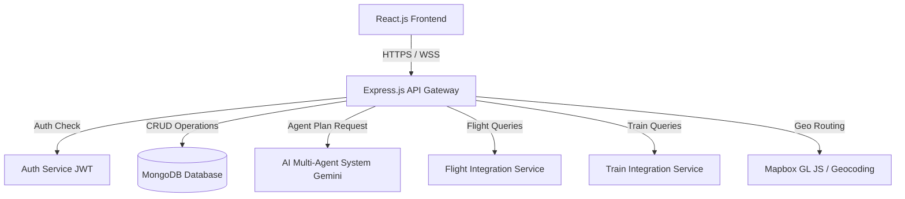
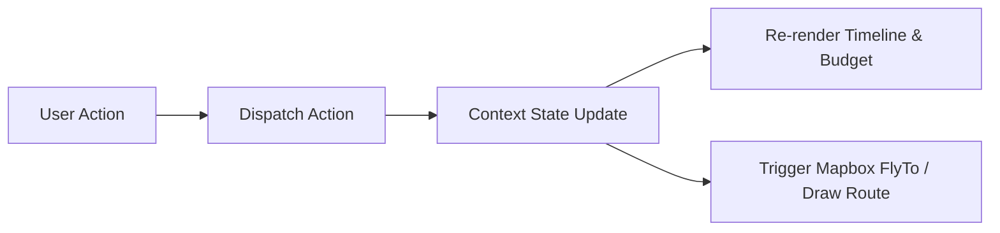
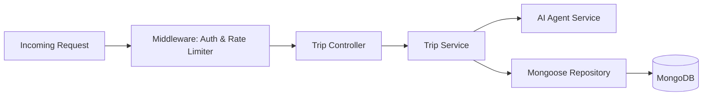
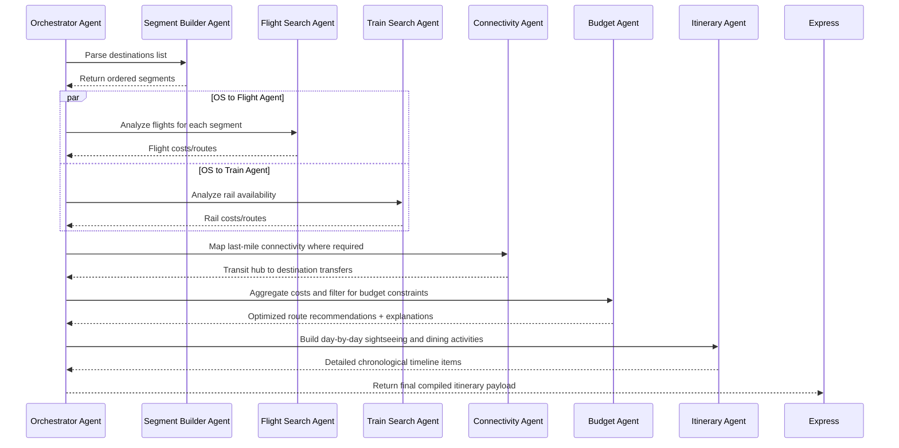
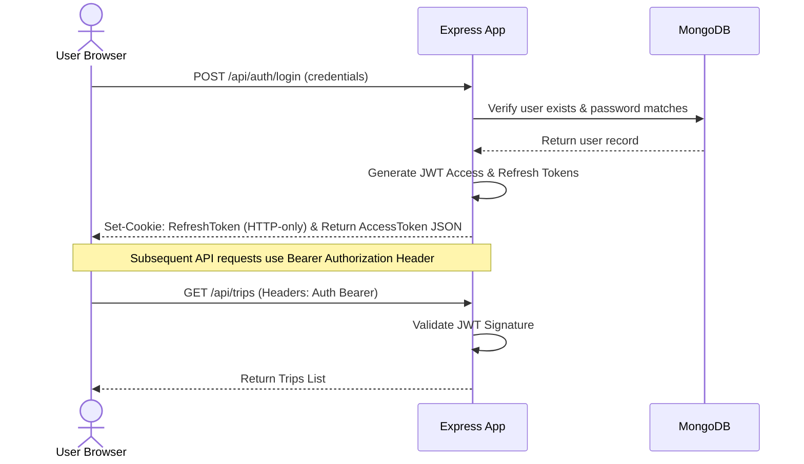

# System Architecture Document - AI Trip Planner

This document details the system design, tech stack integrations, database models, and service interfaces for the AI Trip Planner application, utilizing a **MERN Stack** (React.js, Node.js, Express.js, MongoDB) and a multi-agent AI system.

---

## 1. High-Level Architecture Overview

The system follows a decoupled client-server architecture. The frontend React application communicates with the backend Express API Gateway, which coordinates database access and delegates complex operations to background services (AI, Flight, Train, Maps, and Auth).



---

## 2. Frontend Architecture (React.js)

The frontend is structured as a component-driven Single Page Application (SPA) utilizing modular state management.

### 2.1. File Structure
```
src/
├── assets/          # Static assets (images, icons, fonts)
├── components/      # Reusable UI elements (Buttons, Input, Cards)
│   ├── common/      # Glassmorphic base wrappers, Loader overlays
│   └── maps/        # Mapbox wrapper components
├── context/         # React Context for global state (Auth, active Trip)
├── hooks/           # Custom React hooks (useMap, useAuth, useTrip)
├── pages/           # High-level screens
│   ├── Search.jsx   # Search & input onboarding
│   ├── Route.jsx    # Route analysis & verification
│   └── Dashboard.jsx# Interactive timeline & map split-pane
└── services/        # HTTP API clients (apiClient.js, flightService.js)
```

### 2.2. State Management Flow
React Context manages global authentication and active trip planning parameters, while local state handles UI transitions and timeline animations.



---

## 3. Backend Architecture (Node.js & Express.js)

The backend is built as an asynchronous RESTful API using Express.js.

### 3.1. Layered Architecture
*   **Routing Layer:** Decodes HTTP requests and applies rate-limit and authentication middlewares.
*   **Controller Layer:** Orchestrates business operations, handling request validation and formulating JSON responses.
*   **Service Layer:** Executes specific domain tasks (AI orchestration, external API lookups).
*   **Data Access Layer (Mongoose):** Translates JavaScript objects to MongoDB documents.



---

## 4. Database Schema (MongoDB / Mongoose)

We define three primary collections: `Users`, `Trips`, and `CachedRoutes`.

### 4.1. Users Collection Schema
```javascript
const UserSchema = new mongoose.Schema({
  email: { type: String, required: true, unique: true },
  passwordHash: { type: String, required: true },
  name: { type: String, required: true },
  savedTrips: [{ type: mongoose.Schema.Types.ObjectId, ref: 'Trip' }],
  createdAt: { type: Date, default: Date.now }
});
```

### 4.2. Trips Collection Schema (supports Multi-City Segments)
```javascript
const SegmentSchema = new mongoose.Schema({
  segmentId: { type: String, required: true },
  source: { type: String, required: true },
  destination: { type: String, required: true },
  recommendedRoute: {
    routeId: String,
    steps: [String],
    reason: String
  },
  alternativeRoutes: [{
    routeId: String,
    steps: [String]
  }],
  estimatedCost: Number,
  estimatedDuration: Number // in minutes
});

const TripSchema = new mongoose.Schema({
  userId: { type: mongoose.Schema.Types.ObjectId, ref: 'User', index: true },
  origin: { type: String, required: true },
  destinationList: [{ type: String, required: true }],
  startDate: { type: Date, required: true },
  endDate: { type: Date, required: true },
  budgetTier: { type: String, enum: ['Budget', 'Moderate', 'Luxury'], required: true },
  totalCost: { type: Number, default: 0 },
  currency: { type: String, default: 'USD' },
  segments: [SegmentSchema],
  days: [{
    dayNumber: Number,
    date: Date,
    theme: String,
    items: [{
      itemId: String,
      itemType: { type: String, enum: ['activity', 'transit'] },
      title: String,
      description: String,
      duration: Number,
      cost: Number,
      category: String,
      location: {
        name: String,
        coordinates: {
          type: { type: String, default: 'Point' },
          coordinates: [Number] // [longitude, latitude]
        }
      }
    }]
  }]
});
TripSchema.index({ "days.items.location.coordinates": "2dsphere" });
```

### 4.3. CachedRoutes Collection Schema (API optimization)
```javascript
const CachedRouteSchema = new mongoose.Schema({
  cacheKey: { type: String, required: true, unique: true }, // hash(source + destination + budgetTier)
  routeData: mongoose.Schema.Types.Mixed,
  createdAt: { type: Date, default: Date.now, expires: '7d' } // TTL cache of 7 days
});
```

---

## 5. AI Service (Multi-Agent System)

The AI service utilizes the Gemini API under a multi-agent choreography pattern.



---

## 6. Integration Services

### 6.1. Flight Service
*   **Purpose:** Search for flights between Segment Source and Destination hubs.
*   **Integration:** Integrates with Amadeus/Skyscanner API.
*   **Caching:** Returns cached flight metadata for standard corridors to reduce API overhead, updating pricing dynamically at checkout.

### 6.2. Train Service
*   **Purpose:** Resolves rail routes for intra-continental segments (e.g., European Eurail or Indian Railways).
*   **Integration:** Communicates with national rail databases or third-party transit aggregators (e.g., Rome2Rio API).
*   **Fallback:** If train search fails or times out, defaults to road transit calculations (cabs/buses).

### 6.3. Maps Service
*   **Mapbox GL JS:** Rendered client-side for displaying interactive vector maps, plotting GeoJSON markers, and showing transit lines.
*   **Mapbox Directions/Matrix API:** Used by the backend to calculate precise driving/walking travel times between itinerary events.

---

## 7. Authentication Flow

Authentication is managed using JSON Web Tokens (JWT) secured via HTTP-only cookies to protect against Cross-Site Scripting (XSS).



### 7.1. Public vs. Authenticated Routes
*   **Public Routes:** Onboarding screens, route recommendations, public trip sharing links.
*   **Authenticated Routes:** Saving trips to profile, editing itineraries, sharing customized links with edit access.
