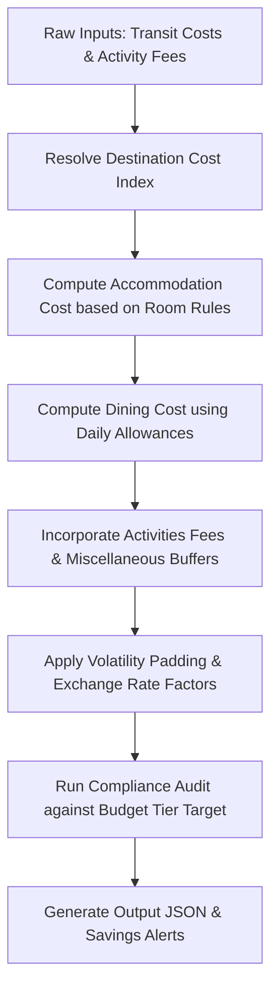

# Budget Planning Skill

## Purpose
The **Budget Planning Skill** estimates, aggregates, and controls costs across all dimensions of a travel itinerary—including transportation, accommodation (hotels), meals (food), activities, and miscellaneous expenses. It ensures that generated itineraries align with the user's defined budget tier (Budget, Moderate, Luxury) and geographical destination cost profiles, dynamically calculating currency conversions and safety buffers to prevent cost overruns.

---

## Responsibilities
*   **Cost Estimation & Breakdown:** Forecast travel costs for each category (transit, hotel, food, activities, and miscellaneous) based on destination cost indexes and market averages.
*   **Accommodation Allocation Math:** Calculate hotel room requirements based on group size and budget-appropriate room configurations.
*   **Daily Food Allowance Rules:** Apply location-specific and budget-tier-appropriate daily food allocations.
*   **Dynamic Exchange Rate Scaling:** Translate cost estimations into the traveler's preferred currency using live currency conversion metrics.
*   **Budget Compliance Auditing:** Monitor cumulative trip costs against safety thresholds, triggering warnings and providing optimization suggestions if target thresholds are breached.

---

## Inputs (JSON schema/example)

### Input JSON Schema
```json
{
  "$schema": "http://json-schema.org/draft-07/schema#",
  "title": "BudgetPlanningInput",
  "type": "object",
  "required": [
    "tripId",
    "budgetTier",
    "travelersCount",
    "currency",
    "destinationList",
    "durationDays",
    "segmentsTransitCost",
    "scheduledActivities"
  ],
  "properties": {
    "tripId": { "type": "string" },
    "budgetTier": {
      "type": "string",
      "enum": ["Budget", "Moderate", "Luxury"]
    },
    "travelersCount": {
      "type": "integer",
      "minimum": 1
    },
    "currency": {
      "type": "string",
      "pattern": "^[A-Z]{3}$",
      "description": "ISO 4217 Currency Code (e.g., USD, EUR, INR)"
    },
    "destinationList": {
      "type": "array",
      "items": { "type": "string" }
    },
    "durationDays": {
      "type": "integer",
      "minimum": 1
    },
    "segmentsTransitCost": {
      "type": "number",
      "minimum": 0,
      "description": "Pre-calculated cost of transportation segments (flights, trains, inter-city cabs)"
    },
    "scheduledActivities": {
      "type": "array",
      "items": {
        "type": "object",
        "required": ["activityId", "category", "knownCost"],
        "properties": {
          "activityId": { "type": "string" },
          "category": {
            "type": "string",
            "enum": ["sightseeing", "dining", "adventure", "shopping", "transport"]
          },
          "knownCost": { "type": "number", "minimum": 0 }
        }
      }
    }
  }
}
```

### Input JSON Example
```json
{
  "tripId": "trp_bud_002",
  "budgetTier": "Moderate",
  "travelersCount": 2,
  "currency": "USD",
  "destinationList": ["Shirdi", "Tirupati"],
  "durationDays": 4,
  "segmentsTransitCost": 150.00,
  "scheduledActivities": [
    { "activityId": "act_01", "category": "sightseeing", "knownCost": 10.00 },
    { "activityId": "act_02", "category": "adventure", "knownCost": 25.00 }
  ]
}
```

---

## Outputs (JSON schema/example with confidence score)

### Output JSON Schema
```json
{
  "$schema": "http://json-schema.org/draft-07/schema#",
  "title": "BudgetPlanningOutput",
  "type": "object",
  "required": [
    "tripId",
    "totalEstimatedCost",
    "breakdown",
    "status",
    "costPerTraveler",
    "currency",
    "savingsOpportunities",
    "confidenceScore"
  ],
  "properties": {
    "tripId": { "type": "string" },
    "totalEstimatedCost": { "type": "number", "minimum": 0 },
    "breakdown": {
      "type": "object",
      "required": ["transport", "accommodation", "food", "activities", "miscellaneous"],
      "properties": {
        "transport": { "type": "number" },
        "accommodation": { "type": "number" },
        "food": { "type": "number" },
        "activities": { "type": "number" },
        "miscellaneous": { "type": "number" }
      }
    },
    "status": {
      "type": "string",
      "enum": ["under_budget", "on_target", "over_budget"]
    },
    "costPerTraveler": { "type": "number" },
    "currency": { "type": "string" },
    "savingsOpportunities": {
      "type": "array",
      "items": { "type": "string" }
    },
    "confidenceScore": {
      "type": "number",
      "minimum": 0.0,
      "maximum": 1.0
    }
  }
}
```

### Output JSON Example
```json
{
  "tripId": "trp_bud_002",
  "totalEstimatedCost": 490.00,
  "breakdown": {
    "transport": 150.00,
    "accommodation": 160.00,
    "food": 100.00,
    "activities": 35.00,
    "miscellaneous": 45.00
  },
  "status": "on_target",
  "costPerTraveler": 245.00,
  "currency": "USD",
  "savingsOpportunities": [
    "Opt for shared public transportation in Tirupati to save $15 on local travel.",
    "Book accommodation 14 days in advance near Shirdi Temple for a 10% rate reduction."
  ],
  "confidenceScore": 0.92
}
```

---

## Decision Rules

### 1. Cost Profiles by Budget Tier (Base USD rates per traveler per day)
The planner applies cost rules scaled by destination tier index (derived from local cost of living data):

| Budget Tier | Hotel Rate (Room/Night) | Food & Beverage (Per Day) | Miscellaneous (Per Day) | Room Sharing Ratio |
| :--- | :--- | :--- | :--- | :--- |
| **Budget** | $25 | $12 | $5 | Max 3 travelers per room |
| **Moderate** | $80 | $25 | $15 | Max 2 travelers per room |
| **Luxury** | $250 | $75 | $40 | Max 2 travelers per room |

### 2. Room Calculation Math
$$\text{Rooms Needed} = \text{ceil}\left(\frac{\text{travelersCount}}{\text{Max Travelers per Room}}\right)$$

$$\text{Accommodation Cost} = \text{Rooms Needed} \times \text{Hotel Rate} \times (\text{durationDays} - 1)$$

### 3. Food Cost Calculation
$$\text{Food Cost} = \text{travelersCount} \times \text{Food \& Beverage Rate} \times \text{durationDays}$$

### 4. Safety Margins and Volatility
*   **Rule 4.1:** Volatility buffer is determined by trip lead time:
    *   Trip starts in $< 7\text{ days}$: add **2%** padding.
    *   Trip starts in $7 - 30\text{ days}$: add **5%** padding.
    *   Trip starts in $> 30\text{ days}$: add **10%** padding (handles seasonal rate changes).
*   **Rule 4.2:** Currency Exchange Protection Fee:
    *   For international trips involving different local currencies, add a flat **3%** conversion margin to prevent bank fee surprises.

---

## Reasoning Strategy
The Budget Planning Skill operates on a **Bottom-Up Cost Aggregation Pipeline**:



1.  **Index Lookup:** Query database records to extract the destination cost multiplier (e.g., Shirdi has an index of $0.65$ relative to base USD, whereas New York has an index of $1.85$).
2.  **Base Allocation:** Calculate baseline Accommodation and Food costs, applying the destination multiplier.
3.  **Synthesis:** Aggregate actual known segment transit costs and confirmed activity prices.
4.  **Buffer Allocation:** Calculate and apply the volatility buffer based on lead time.
5.  **Audit Assessment:** Compare the final sum against the maximum expected budget for the selected tier:
    *   If total cost $\le 0.85 \times \text{Budget Target}$: mark status as `under_budget`.
    *   If $0.85 \times \text{Budget Target} < \text{total cost} \le 1.05 \times \text{Budget Target}$: mark status as `on_target`.
    *   If total cost $> 1.05 \times \text{Budget Target}$: mark status as `over_budget`, scan itinerary for expensive activities, and write budget-reduction tips.

---

## Data Sources
*   **Numbeo API / City Cost Index:** Provides cost-of-living metrics, average meal prices, and hotel accommodation baseline statistics.
*   **Open Exchange Rates API:** Returns real-time currency conversion rates (updated daily).
*   **Mongoose CachedRoutes Database:** Retains pricing logs of similar segments to determine average price adjustments.

---

## Error Handling
*   **Missing Destination Index:** If a destination does not exist in the cost index database, the skill defaults to the national average index of the target country.
*   **Currency Fetch Timeout:** If the live exchange rate API fails to resolve within 5 seconds, the system falls back to the static conversion rate array hardcoded in the database system.
*   **Zero-Cost Activity Fallback:** If an activity category has a cost of $0.00$ in the database but is labeled as high-cost (e.g. "scuba diving"), the skill overrides it with a default category cost index ($25.00\text{ USD}$ baseline).

---

## Validation Rules
*   **Completeness check:** `travelersCount` and `durationDays` must be positive non-zero integers.
*   **Currency Code Safety:** The `currency` code must be validated against a list of ISO-compliant standard abbreviations.
*   **Mathematical Alignment:** The sum of `breakdown.transport` + `breakdown.accommodation` + `breakdown.food` + `breakdown.activities` + `breakdown.miscellaneous` must equal `totalEstimatedCost` within a tolerance margin of $0.01$.

---

## Confidence Score
The `confidenceScore` represents the accuracy limit of the budget. It is formulated as:

$$\text{Confidence Score} = (0.5 \cdot C_{\text{actual}}) + (0.3 \cdot C_{\text{index}}) + (0.2 \cdot C_{\text{currency}})$$

Where:
*   $C_{\text{actual}}$ (Ratio of Known Costs): $\frac{\text{Known Transport Costs} + \text{Known Activity Costs}}{\text{Total Estimated Cost}}$.
*   $C_{\text{index}}$ (Index Match Reliability): $1.0$ if destination is matched directly to a major city cost index; $0.7$ if country-level averages are used.
*   $C_{\text{currency}}$ (Conversion Certainty): $1.0$ if no currency conversions are required; $0.8$ if dynamic conversion coefficients are applied.

---

## Example Scenarios

### Scenario 1: Moderate Multi-City Pilgrimage (Family of 4)
*   **Input Parameters:**
    ```json
    {
      "tripId": "trp_ex_b1",
      "budgetTier": "Moderate",
      "travelersCount": 4,
      "currency": "INR",
      "destinationList": ["Shirdi", "Tirupati"],
      "durationDays": 5,
      "segmentsTransitCost": 12000.00,
      "scheduledActivities": [
        { "activityId": "act_t1", "category": "sightseeing", "knownCost": 1000.00 }
      ]
    }
    ```
*   **Execution Logic:**
    *   Rooms needed: $\text{ceil}(4/2) = 2$ rooms.
    *   Moderate accommodation rate in India (destination index $0.45$): $\text{Base } 80 \times 0.45 = 36\text{ USD} \approx 3000\text{ INR}$ per room/night.
    *   Accommodation total: $2\text{ rooms} \times 3000\text{ INR} \times 4\text{ nights} = 24000\text{ INR}$.
    *   Moderate food rate in India: $25 \times 0.45 \approx 11.25\text{ USD} \approx 940\text{ INR}$ per traveler/day.
    *   Food total: $4 \times 940 \times 5 = 18800\text{ INR}$.
    *   Activity total: $1000\text{ INR}$.
    *   Miscellaneous: $4 \times (15 \times 0.45 \approx 560\text{ INR}) \times 5\text{ days} = 11200\text{ INR}$.
    *   Sum: $12000 + 24000 + 18800 + 1000 + 11200 = 67000\text{ INR}$.
*   **Output Result:**
    ```json
    {
      "tripId": "trp_ex_b1",
      "totalEstimatedCost": 67000.00,
      "breakdown": {
        "transport": 12000.00,
        "accommodation": 24000.00,
        "food": 18800.00,
        "activities": 1000.00,
        "miscellaneous": 11200.00
      },
      "status": "on_target",
      "costPerTraveler": 16750.00,
      "currency": "INR",
      "savingsOpportunities": [
        "Booking temple accommodations directly through official shrines can save up to 40% compared to local hotels."
      ],
      "confidenceScore": 0.94
    }
    ```

### Scenario 2: Budget Backpacker (Solo Traveler)
*   **Input Parameters:**
    ```json
    {
      "tripId": "trp_ex_b2",
      "budgetTier": "Budget",
      "travelersCount": 1,
      "currency": "USD",
      "destinationList": ["Hyderabad"],
      "durationDays": 3,
      "segmentsTransitCost": 25.00,
      "scheduledActivities": []
    }
    ```
*   **Execution Logic:**
    *   Rooms needed: $1$ room.
    *   Budget rate (index $0.50$): $25 \times 0.50 = 12.50\text{ USD}$ per room/night.
    *   Accommodation total: $1 \times 12.50 \times 2\text{ nights} = 25.00\text{ USD}$.
    *   Food rate: $12 \times 0.50 = 6.00\text{ USD}$ per day.
    *   Food total: $1 \times 6.00 \times 3\text{ days} = 18.00\text{ USD}$.
    *   Miscellaneous: $1 \times (5 \times 0.50) \times 3 = 7.50\text{ USD}$.
    *   Sum: $25.00\text{ transit} + 25.00\text{ hotel} + 18.00\text{ food} + 7.50\text{ misc} = 75.50\text{ USD}$.
*   **Output Result:**
    ```json
    {
      "tripId": "trp_ex_b2",
      "totalEstimatedCost": 75.50,
      "breakdown": {
        "transport": 25.00,
        "accommodation": 25.00,
        "food": 18.00,
        "activities": 0.00,
        "miscellaneous": 7.50
      },
      "status": "under_budget",
      "costPerTraveler": 75.50,
      "currency": "USD",
      "savingsOpportunities": [],
      "confidenceScore": 0.88
    }
    ```

### Scenario 3: Luxury Honeymoon (2 Travelers)
*   **Input Parameters:**
    ```json
    {
      "tripId": "trp_ex_b3",
      "budgetTier": "Luxury",
      "travelersCount": 2,
      "currency": "USD",
      "destinationList": ["Udaipur"],
      "durationDays": 4,
      "segmentsTransitCost": 450.00,
      "scheduledActivities": [
        { "activityId": "act_l1", "category": "adventure", "knownCost": 150.00 }
      ]
    }
    ```
*   **Execution Logic:**
    *   Rooms needed: $1$ room.
    *   Luxury rate in Udaipur (index $0.70$): $250 \times 0.70 = 175.00\text{ USD}$ per room/night.
    *   Accommodation total: $1 \times 175.00 \times 3\text{ nights} = 525.00\text{ USD}$.
    *   Food rate: $75 \times 0.70 = 52.50\text{ USD}$ per traveler/day.
    *   Food total: $2 \times 52.50 \times 4\text{ days} = 420.00\text{ USD}$.
    *   Activities: $150.00\text{ USD}$.
    *   Miscellaneous: $2 \times (40 \times 0.70) \times 4 = 224.00\text{ USD}$.
    *   Sum: $450.00\text{ transit} + 525.00\text{ hotel} + 420.00\text{ food} + 150.00\text{ activity} + 224.00\text{ misc} = 1769.00\text{ USD}$.
*   **Output Result:**
    ```json
    {
      "tripId": "trp_ex_b3",
      "totalEstimatedCost": 1769.00,
      "breakdown": {
        "transport": 450.00,
        "accommodation": 525.00,
        "food": 420.00,
        "activities": 150.00,
        "miscellaneous": 224.00
      },
      "status": "on_target",
      "costPerTraveler": 884.50,
      "currency": "USD",
      "savingsOpportunities": [
        "Consider booking airport transfers through independent luxury cabs instead of the hotel concierge to save $30."
      ],
      "confidenceScore": 0.96
    }
    ```

---

## Dependencies
*   **Segment Builder Agent:** Delivers destination paths and chronologically maps duration variables.
*   **Flight Search / Train Search Agents:** Feed active transit pricing quotes.
*   **Itinerary Agent:** Defines the activities scheduled per day, facilitating activity fee aggregation.
*   **Third-party Currency Service:** Provides live currency coefficients.

---

## Success Criteria
*   **Audit Latency:** Calculate, crosscheck, and compile budget outputs in under 2.0 seconds.
*   **Mathematical Precision:** The overall cost calculation must maintain perfect consistency with individual categories.
*   **Estimation accuracy:** Forecasts for hotel, dining, and activities must remain within a 10% margin of verified local prices.
