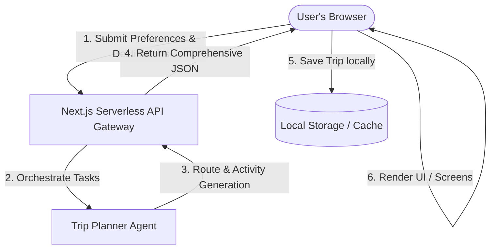
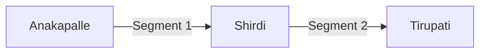
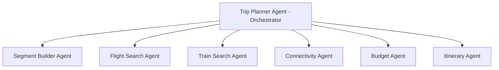

# Functional Specification Document - AI Trip Planner

This document provides a detailed functional specification for the AI Trip Planner application, building upon the [Project Vision](file:///C:/Users/HI/Desktop/AI-TRIP-PLANNER/docs/vision.md) and the [Product Requirements Document (PRD)](file:///C:/Users/HI/Desktop/AI-TRIP-PLANNER/docs/prd.md).

---

## 1. System Architecture & Information Flow

The AI Trip Planner operates as a single-page application (SPA) with serverless backend APIs that orchestrate data between a multi-agent AI system, mapping APIs, transit data APIs, and the client browser.



---

## 2. User Interface & Screen Specifications

The application UI consists of four core interfaces: the **Onboarding & Search Screen**, the **Route Analysis Screen**, the **Trip Planner Dashboard**, and the **Share & Export view**.

### 2.1. Onboarding & Search Screen
A card-based flow supporting multi-destination entries.

*   **Origin Input (`#input-origin`):** Text input with auto-complete for origin city/airport.
*   **Destination List Container (`#destination-list`):** Dynamic input list where users can click "Add Destination" to plan a multi-city route.
*   **Date Picker (`#input-dates`):** Multi-segment date selectors or a global trip date range.
*   **Budget Selector (`#select-budget`):** Segmented control slider (*Budget*, *Moderate*, *Luxury*).
*   **Travel Style Tags (`#select-styles`):** Interactive toggle chips (Adventure, Culture, Food, Nature, Nightlife, Relaxing, Family).

---

### 2.2. Route Analysis Screen (`#route-analysis-screen`)
A transitional dashboard shown to users *before* the detailed daily itinerary is generated. This screen allows users to review, configure, and approve transit options between destinations.

*   **Segment Selector:** Tabs to toggle between segments (e.g., "Segment 1: Anakapalle → Shirdi", "Segment 2: Shirdi → Tirupati").
*   **Transit Options Grid:**
    *   **Flight Options Tab (`#flight-options`):** Displays airline, duration, price, layovers, and nearest airport.
    *   **Train Options Tab (`#train-options`):** Displays train name/number, class, station, departure, duration, and price.
*   **Recommended Route Card (`#recommended-route`):** Shows the selected primary route, highlight of cost/duration, and the "Recommendation Explanation" (see Section 6).
*   **Generate Itinerary Button (`#btn-confirm-routes`):** Confirms routes and triggers final itinerary/activity generation.

---

### 2.3. Multi-City Trip Creation
Users can create trips containing multiple ordered destinations. The system automatically divides the trip into consecutive chronological segments.

*   **Input Example:**
    *   **Source:** Anakapalle
    *   **Destinations:** [Shirdi, Tirupati, Hyderabad]
*   **Segment Generation Logic:**
    *   **Segment 1:** Anakapalle → Shirdi
    *   **Segment 2:** Shirdi → Tirupati
    *   **Segment 3:** Tirupati → Hyderabad
*   **Processing Rules:** The Itinerary Generation Engine resolves the segments sequentially, ensuring travel times overlap correctly and check-in times at the next city line up with the arrival times of transit steps.

---

### 2.4. Trip Planner Dashboard (`#dashboard-view`)
The final view featuring a split-screen dashboard:
*   **Left Timeline Pane (`#timeline-pane`):** Displays day-by-day itinerary cards, split between travel/transit cards and sightseeing/dining cards.
*   **Right Map Pane (`#map-pane`):** Rendered using Mapbox GL JS, displaying route lines and marker pins for the active day.

---

## 3. Trip Segment Concept

A trip consists of one or more segments. Each segment represents travel between two distinct geographical points (Source → Destination).



### 3.1. Segment Processing Pipeline
For every segment added by the user, the backend triggers four concurrent analysis processes:
1.  **Flight Analysis:** Evaluates route viability, local airlines, airport codes, average cost, and schedules.
2.  **Train Analysis:** Maps route against national railway networks, scheduling, class availability, and station routing.
3.  **Connectivity Analysis:** Evaluates last-mile travel if direct paths do not exist.
4.  **Cost Analysis:** Computes and summarizes total travel costs for budget alignment.

---

## 4. Transportation Analysis Engine

For each segment, the transportation analysis engine evaluates multi-modal alternatives.

### 4.1. Analysis Steps
1.  **Flight Search:** Queries flight aggregators for connections between nearest airports.
2.  **Train Search:** Queries railway APIs for direct/indirect train connections.
3.  **Bus Search (Optional):** Checks regional bus systems for shorter segments or budget tiers.
4.  **Route Optimization:** Calculates the Pareto frontier (balancing speed, cost, and transfers).
5.  **Cost Comparison:** Ranks routes by budget alignment.

### 4.2. Output Schema
*   **Recommended Route:** The optimal transit sequence selected by the AI based on budget and speed.
*   **Alternative Routes:** 2-3 backup options (e.g., "Cheapest Option", "Fastest Option").
*   **Cost Estimate:** Total cost in selected currency.
*   **Duration Estimate:** Total travel time including layovers/waiting times.

---

## 5. Connectivity Analysis Engine

The **Connectivity Analysis Engine** determines how users can reach destinations lacking direct airport or railway connectivity.

### 5.1. Workflow
1.  **Find Nearest Airport:** Geocodes the destination and scans a database of commercial airports within a 150km radius.
2.  **Find Nearest Railway Station:** Scans regional rail networks for operating stations within a 100km radius.
3.  **Calculate Distance:** Computes driving/transit distance between nearest hubs and final destination.
4.  **Recommend Local Transport:** Suggests specific options (taxi, shuttle, public bus, ferry) to cover the intermediate gap.

### 5.2. Practical Example
*   **Destination:** Shirdi, India
*   **Nearest Airport:** Shirdi Airport (SAG)
*   **Nearest Railway Station:** Kopargaon (KPG)
*   **Distance (Station to Destination):** 16 km
*   **Suggested Route:** Taxi → Kopargaon Station → Train → Destination

---

## 6. Explainable Recommendations

The AI must provide clear, natural-language rationales explaining *why* a specific route combination is recommended over alternatives.

*   **Example Recommendation:**
    *   **Recommended Route:** Taxi → Vizag Airport (VTZ) → Flight → Hyderabad (HYD) → Flight → Shirdi (SAG).
    *   **Reason:**
        *   *Fastest Route:* Saves 8 hours compared to the train.
        *   *Within Budget:* Moderate tier target is $150; this route costs $135.
        *   *Fewer Transfers:* Only one domestic layover in Hyderabad.

---

## 7. AI Agent Workflow

To achieve specialized planning, the system delegates tasks to a coordinated group of AI agents overseen by an orchestrator.



*   **Trip Planner Agent:** Orchestrator. Directs user requests, aggregates outputs, and serves final JSON.
*   **Segment Builder Agent:** Splits inputs into consecutive segments and coordinates timing constraints.
*   **Flight Search Agent:** Performs lookup on airlines, airport routes, and pricing.
*   **Train Search Agent:** Maps rail connections, station names, and schedules.
*   **Connectivity Agent:** Evaluates last-mile local transport, distance calculations, and station/airport hubs.
*   **Budget Agent:** Tracks cost limits, handles conversions, and optimizes for target budget tiers.
*   **Itinerary Agent:** Researches daily sightseeing attractions, dining options, and durations.

---

## 8. JSON Schema for Trip Data

```json
{
  "$schema": "http://json-schema.org/draft-07/schema#",
  "title": "TripItinerary",
  "type": "object",
  "required": ["tripId", "origin", "destinationList", "startDate", "endDate", "budgetTier", "totalEstimatedCost", "currency", "segments", "days"],
  "properties": {
    "tripId": { "type": "string" },
    "origin": { "type": "string" },
    "destinationList": {
      "type": "array",
      "items": { "type": "string" }
    },
    "startDate": { "type": "string", "format": "date" },
    "endDate": { "type": "string", "format": "date" },
    "budgetTier": { "type": "string", "enum": ["Budget", "Moderate", "Luxury"] },
    "totalEstimatedCost": { "type": "number" },
    "currency": { "type": "string", "default": "USD" },
    "segments": {
      "type": "array",
      "items": {
        "type": "object",
        "required": ["segmentId", "source", "destination", "recommendedRoute", "alternativeRoutes", "estimatedCost", "estimatedDuration"],
        "properties": {
          "segmentId": { "type": "string" },
          "source": { "type": "string" },
          "destination": { "type": "string" },
          "recommendedRoute": {
            "type": "object",
            "required": ["routeId", "steps", "reason"],
            "properties": {
              "routeId": { "type": "string" },
              "steps": {
                "type": "array",
                "items": { "type": "string" }
              },
              "reason": { "type": "string" }
            }
          },
          "alternativeRoutes": {
            "type": "array",
            "items": {
              "type": "object",
              "required": ["routeId", "steps"],
              "properties": {
                "routeId": { "type": "string" },
                "steps": {
                  "type": "array",
                  "items": { "type": "string" }
                }
              }
            }
          },
          "estimatedCost": { "type": "number" },
          "estimatedDuration": { "type": "number" }
        }
      }
    },
    "days": {
      "type": "array",
      "items": {
        "type": "object",
        "required": ["dayNumber", "date", "theme", "items"],
        "properties": {
          "dayNumber": { "type": "integer" },
          "date": { "type": "string", "format": "date" },
          "theme": { "type": "string" },
          "items": {
            "type": "array",
            "items": {
              "type": "object",
              "required": ["itemId", "itemType", "title", "description", "estimatedDurationMinutes", "estimatedCost"],
              "properties": {
                "itemId": { "type": "string" },
                "itemType": { "type": "string", "enum": ["activity", "transit"] },
                "title": { "type": "string" },
                "description": { "type": "string" },
                "estimatedDurationMinutes": { "type": "integer" },
                "estimatedCost": { "type": "number" },
                "category": { "type": "string" },
                "location": {
                  "type": "object",
                  "required": ["name", "latitude", "longitude"],
                  "properties": {
                    "name": { "type": "string" },
                    "latitude": { "type": "number" },
                    "longitude": { "type": "number" }
                  }
                }
              }
            }
          }
        }
      }
    }
  }
}
```

---

## 9. API Contracts

### 9.1. Main Endpoints

*   **`/api/generate-itinerary` (POST):** Generates day-by-day attractions based on user-approved routes.
*   **`/api/analyze-trip` (POST):** Splits destination inputs into segments and performs initial transit analysis.
*   **`/api/find-flights` (POST):** Deep search for flights between coordinates or airport codes.
*   **`/api/find-trains` (POST):** Queries railway routing systems for rail connections.
*   **`/api/analyze-connectivity` (POST):** Specifically triggers nearest hub lookup and last-mile calculations.
*   **`/api/calculate-budget` (POST):** Takes transit/activity lists and runs live cost conversions/summation.

### 9.2. Sample Request: `/api/analyze-trip`
```json
{
  "origin": "Anakapalle",
  "destinations": ["Shirdi", "Tirupati", "Hyderabad"],
  "budgetTier": "Moderate"
}
```
### 9.3. Sample Response: `/api/analyze-trip` (Segment 1 Snippet)
```json
{
  "segments": [
    {
      "segmentId": "sg_1",
      "source": "Anakapalle",
      "destination": "Shirdi",
      "recommendedRoute": {
        "routeId": "rt_fastest_1",
        "steps": [
          "Taxi from Anakapalle to Vizag Airport (VTZ)",
          "Flight from VTZ to Hyderabad (HYD)",
          "Flight from HYD to Shirdi Airport (SAG)",
          "Local Taxi from SAG to Shirdi Temple Area"
        ],
        "reason": "Fastest route. Saves 8 hours compared to rail. Within budget limit."
      },
      "alternativeRoutes": [
        {
          "routeId": "rt_cheapest_1",
          "steps": [
            "Train from Anakapalle to Kopargaon Station",
            "Taxi from Kopargaon to Shirdi (16 km)"
          ]
        }
      ],
      "estimatedCost": 135.00,
      "estimatedDuration": 360
    }
  ]
}
```

---

## 10. Edge Cases & Error Handling

### 10.1. No Connectivity
*   **Scenario:** A destination has no airport and no railway station nearby (e.g., a remote village or deep mountain retreat).
*   **System Action:**
    1.  The **Connectivity Agent** expands its lookup radius up to 300km to locate the nearest major commercial transport hub (airport or rail junction).
    2.  Suggests regional bus services or long-distance taxi transfers.
    3.  Generates a clear explanation outlining the driving route and expected conditions.
    4.  Appends an estimated cost range for private vs. public transport options.

### 10.2. AI Hallucination & Bad Geo-Coordinates
*   **Scenario:** Gemini provides incorrect coordinates for local sights.
*   **Mitigation:** The backend validates coordinates against real map data and falls back to city center coordinates if invalid, appending a warning tag.
